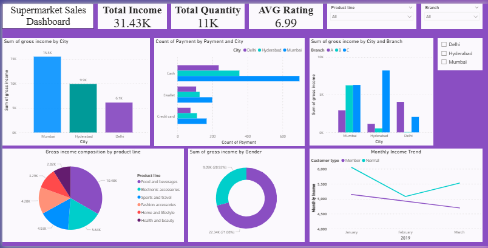

# 📊 Sales Analytics Dashboard – Power BI

## 📌 Project Overview

This project is an interactive Sales Analytics Dashboard developed using Microsoft Power BI. The dashboard transforms sales data into meaningful visual insights to understand business performance, sales trends, product performance, and customer behavior.

## 🎯 Objective

The objective of this project is to analyze sales data and create an interactive dashboard that helps users monitor key performance indicators and identify important business trends.

## 🛠️ Tools & Technologies

- Microsoft Power BI
- Power Query
- DAX
- Data Modeling
- Data Cleaning & Transformation
- Data Visualization

## 📈 Dashboard Features

- Sales performance analysis
- Revenue and profit analysis
- Product-wise sales analysis
- Customer analysis
- Regional sales analysis
- KPI cards
- Interactive slicers and filters
- Sales trend analysis
- Interactive data visualizations

## 🔍 Skills Demonstrated

- Data Cleaning
- Data Transformation
- Data Modeling
- DAX Calculations
- Data Visualization
- Business Analytics
- Dashboard Development

## 🖼️ Dashboard Preview

## 📁 Project Files

| File | Description |
|---|---|
| `Sales_Analytics_Dashboard.pbix` | Power BI dashboard file |
| `Dashboard.png` | Dashboard preview image |
| `README.md` | Project documentation |

## 💡 Key Learning Outcomes

- Created interactive dashboards using Power BI
- Performed data cleaning and transformation using Power Query
- Created calculated measures using DAX
- Applied data modeling techniques
- Designed interactive visualizations for business analysis

## 👩‍💻 Author

**Keerthana R**

MSc Artificial Intelligence & Machine Learning  
VIT
